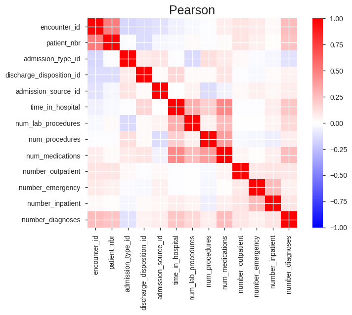
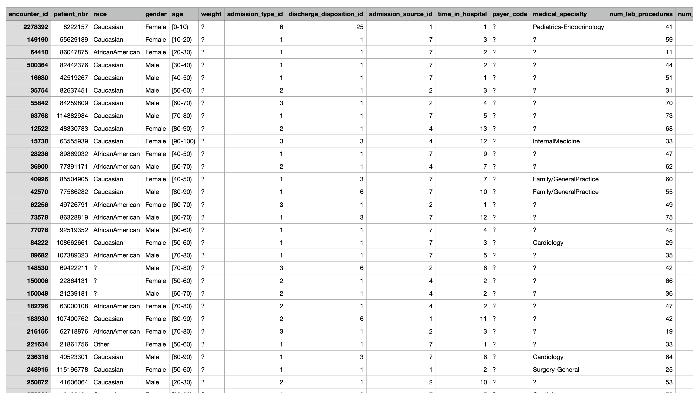
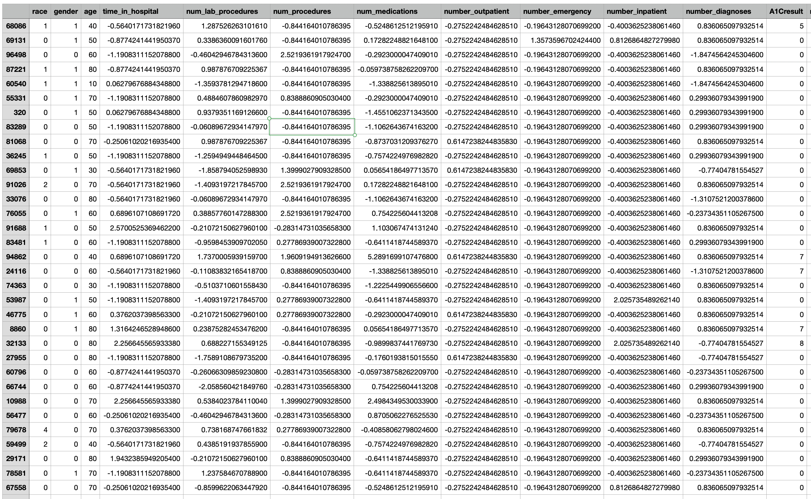
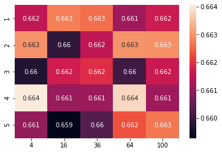
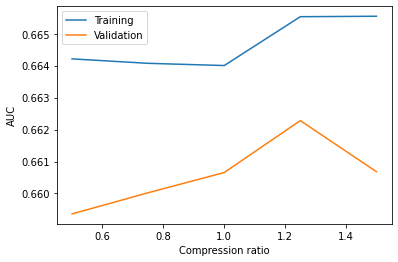
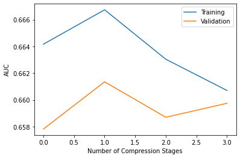
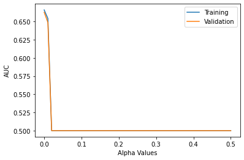
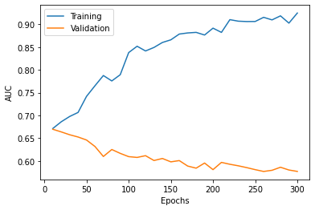
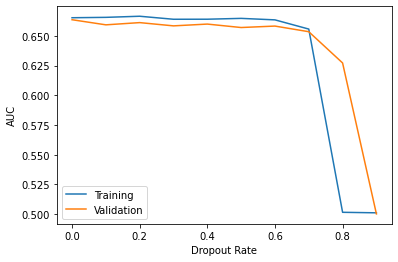

# Predicting Hospital Readmissions

## Overview

Machine learning models offer the ability to make predictions about future events from past records.  By learning patterns in data, a model can generate informed guesses that often exceed chance and even the predictions of human subject matter experts.  With this project, I worked with a team of fellow University of California, Irvine graduate students to build a series of machine learning algorithms that predict the probability diabetes patients might be readmitted to hospital.  This demonstrates my facility with **data grooming, data manipulation, model training, model evaluation, model improvement, model selection, and data science teamwork**.

This project is directly relevant to any organization that has extensive records and wants to extract predictions from those records.  Those predictions could be useful for modifying future plans.  For example, this project deals with predicting hospital readmissions.  It would be directly relevant for doctors, hospital administrators, insurance companies, and patients themselves to know patient risks for readmission.  Using that knowledge could allow for precautions to be taken to reduce those risks.

The machine learning methods that myself and my teammates employed include **linear classifiers, decision trees, neural networks, and random forests**.  These are all examples of **supervised learning**, where models are trained like students at school based on their ability to give correct answers and learn from their mistakes.  We estimated model accuracy with **ROC-AUC** and performed model evaluation via **K-fold cross-validation**.  The software we used included **pandas, numpy, matplotlib, jupyter notebook, scikit-learn, and pytorch**.

My project teammates were [Kate Deyneka](https://www.linkedin.com/in/edeyneka/) and [Brian Tran](https://www.linkedin.com/in/brian-d-tran/).  **The contributions I provided in the project include help with data grooming and manipulation and sole work on linear classifiers and neural networks.**  I also helped author our final report.

## Data Sets

The data set we used is the [diabetes 130-US hospitals set](https://archive-beta.ics.uci.edu/dataset/296/diabetes+130+us+hospitals+for+years+1999+2008) found on the UCI Machine Learning Repo.  It is data taken from 130 US hospitals from 1999 to 2008, and it represents patient and hospital outcomes.  This data set has 50 variables and 101,766 samples.  Examples of variables include patient race, age, time in the hospital, outcomes of various tests run, and so on.

Importantly, the data as presented is a **dirty data set**:  it contains missing entries, duplicate entries, and outlandish values.  We had to do extensive cleaning.  We preprocessed the data using `pandas`, and we leveraged the `pandas-profiling` (found [here](https://pypi.org/project/pandas-profiling/)) module to generate initial diagnostics about the data.  The profile report can be found [here](report.html).  An example of the dirty data can be found below.

To clean our data we did the following.  Missing entries for features and those labeled with a `?` were entered with a `NaN`.  Almost all of the missing entries were in a select few features such as *weight*, which had $97\%$ of its entries missing and *payer_code*, which had $39\%$ of its entries missing.  Because these features were either largely missing or seemed to have little application to the target problem, we opted to drop those features.  Duplicate entries (duplicate patients) were also dropped, where we only kept the initial admission into the hospital.  Finally, many of our features had extreme values.  This can bias machine learning algorithms.  Consequently, we scaled these values:  for numeric entries we subtracted the mean and divided by the variance for the specific features and for categorical features we turned them into one-hot encodings.  We also used integer encodings for categorical data and experimented for their effectiveness.  We found this integer data to be problematic.  So we used the one-hot data for our experiments.

An example of the cleaned data can be seen below:

The dropping of features and addition of one-hot encoding resulted in a cleaned data set with 47 features.  This can be found in the clean data set folder [here](CleanedData/).

For our ground truth-label, we wanted to predict hospital readmission.  The original hospital admission feature had multiple entries, indicating the number of days since readmission.  We decided to use *any readmission* as a readmission; our cut-off dates were infinitely long.  Readmission is now a binary random variable.

After preprocessing, the data set was split into training and test data with the labels separated from the features.  Lastly, we noticed that there was some imbalances in the number of readmits based on dropped duplicate entries.  So we rebalanced the data, and used the balanced data for our training and testing.

Our training data set was split 80/20 into training and validation sets.  The validation set was then randomly split into 10 validation sets for cross-validation.  Lastly, we created a separate held out test set to run models against.

## Statistical Methods

The primary methods we used to evaluate our models was **Area under the Receiver Operating Charcteristic curve (ROC-AUC)** and **K-fold cross-validation**.

ROC-AUC is a measure of accuracy by measuring a model's true positive and false positive rates.  The true positive rate ($TPR$) is the probability that a model predicts a label given the ground truth label being that label; the false positive rate ($FPR$) is the probability that a model predicts some other label given the ground truth label.  We compute the true positive rate by taking the ratio of the quantity of true positives $TP$ (number of hits on the correct label) by the sum of the true positives plus the false negatives $FN$ (number of misses on the correct label):

$$ TPR = \frac{TP}{TP + FN} $$

We compute the false positive rate by taking the ratio of the quantity of false positives $FP$ (number of hits on the incorrect label) by the sum of the false positives plus the true negatives $TN$ (number of misses on the incorrect label):

$$ FPR = \frac{FP}{FP + TN} $$

Intuitively, we can think about ROC-AUC as measuring how well our model guesses correctly to incorrectly (hits relative to misses).  Our model estimates probabilities for the underlying distribution of categorical labels.  This is called the ROC curve.  Random guessing would equate to equal TPR and FPR.  Better than random guessing would be to maximize TPR relative to FPR.  We then measure the relative area under our ROC curve with respect to random guessing.  This area under the curve indicates how well our model can separate the distributions corresponding to our different labels.  So a higher ROC-AUC, the better our model:  1 being perfect, 0.5 indicating random guessing, and 0 being the worst.

K-fold cross-validation is a method of validating model performance.  We do not want our models to simply memorize the data they have learned in training.  To prevent this, we always measure model performance relative to a validation set:  training data that has been held out to test our model on.  Unfortunately, the set of data we may validate our model on might be configured in a way so as to allow our model to be lucky; its actual performance in the world may not match how it does on the validation set.  To hedge against this, we split our hold out data into separate validation sets and test our model in each validation set and then average its performance.

For our project, we split our validation data into **10** different sets and ran cross-validation on those sets.

## Machine Learning Methods

We used linear classifiers, decision trees, neural networks, and random forests for predicting hospital readmission.  My contribution was work on the **linear classifiers and neural networks**.  Both of my methods were trained using **stochastic gradient descent** in `pytorch`.  In addition, regularization techniques were employed such as **L2, early stopping, and dropout**.

A linear classifier is a prediction based on a weighted sum of features.  It is the discrete version of a linear regression where we have to make categorical predictions instead of continous ones.  Our prediction is the label whose parameters maximize a linear sum of the features. If $\overline{x} = (x_{1}, \dots, x_{k})$ are our features and $\overline{\theta} = (\theta_{0}^{y}, \theta_{1}^{y}, \dots, \theta_{k}^{y})$ are our weights for label $y$ of our available labels $Y$ and $\Theta$ is the set of every weights, then the prediction is $f$:

$$ f(\overline{x}; \Theta) = \underset{y \in Y}{\arg \max} \underset{i=1}{\overset{k}{\sum}} \theta_{i}^{y}x_{i} + \theta_{0}^{y} $$

Intuitively, if we plot our samples in space whose dimensions are given by our $k$ features, the linear classifier separates samples by drawing a "line" (hyperplane) through that space.  Our model is characterized by this decision line, and we can think of our weights as specifying where that decision line lies in feature space.

Neural networks are an extension of linear classifiers.  Often, our features cannot be separated by such a "decision line".  However, by transforming our feature space, we can sort our samples so that they can be linearly separated.  A neural network is a method for learning how to transform our features.  We do this by passing our features through successive linear and non-linear transformations.  Each successive transformation consists of a linear operation followed by a non-linear operation.  The linear operation is the same as in linear classifiers:  features from earlier in the model are weighted by some parameters and those multiplications are summed.  The non-linear operation is some function, such as the sigmoid function or $\max (0,x)$ function, whose transformation is not equivalent with a weighting and sum.  After the non-linear operation is done, it is passed as a feature onto the next stage of the model.  Mathematically, the output function $g$ is a series of non-linear and linear operations, where $\phi$ is a non-linear function and $\overline{\theta}_{i} \in \Theta$ are a matrix of  weights for each $i = \{1, \dots, j \}$:

$$ g(\overline{x}; \Theta) = \phi (\overline{\theta}_{j} $$

Here we think about the sum and products as dot products.  The name "neural network" comes from interpreting each matrix as a layer of neurons and each column in the matrix as corresponding to the weights a particular neuron assigns to its inputs (the rows in the matrix).  Intuitively, we can think of each neuron weighing its inputs (the entries in the column) and then summing over those inputs.  This sum is then fed to a non-linear function, sometimes called an activation function, which decides how the neuron "fires" in response to its inputs.

Every neural network model used the **rectified linear unit (RELU)** given by $\max (0, \overline{x})$ for its non-linear transformation (activation function).

The key parameters that drive the ability for linear classifiers and neural networks are the weights.  Initially, these weights are random, but over time, a machine learning model learns these weights via a learning algorithm.  The algorithm of choice is stochastic gradient descent.  Intuively, gradient descent is an optimization procedure through parameter space that adjusts parameters by following the contours of that space to valleys called local minima.  In the case of model optimization, a model's parameters are adjusted by decreasing the weights that contributed to the model's error on the training data set by some parameter $\eta$ called the learning rate.  This can be expensive, however, so we only evaluate the model's error rate on a small sample of training data.  Our random sampling procedure is what makes this "stochastic".

I used the **Adam optimizer** found in `pytorch` to implement gradient descent.

Regularization is collection of methods that aim to prevent models from simply memorizing (overfitting) the data.  The goal for a good predictive algorithm is that it can generalize to new instances it has not seen so far.  Intuitively, regularization can be thought of penalizing models for their complexity and encouraging simplicity.  The regularization methods I used include L2, early stopping, and dropout.  L2 regularization modifies the error (or loss or cost) function by adding to the error the sum of the square of the weights multiplied by a $\lambda$ parameter; the thought is that bigger weights lead to more overfitting so those bigger weights are penalized by some factor $\lambda$.  Early stopping is a method by which we stop models early in the training process to prevent them from committing too much memorization.  Dropout is an bagging method for regularization.  It works by forcing the model during training to use only a certain portion of its parameters for making predictions.  This can be thought of as a "wisdom of the crowds" method because the model is really an ensemble of simpler predictors after drop out training.

I used the applicable functions for L2 and dropout found in `pytorch`.  Early stopping was directly implemented by my code.

## Experiments

I conducted a series of experiments with linear classifiers and neural networks.  The first experiments were with linear classifiers to find a good baseline for evaluating model performance.  This was also used to evaluate whether the integer or one-hot encoding would be best for the data sets.

My initial experiments with neural networks was to find the right number of parameters and number of transformations (layers) for the problem before us.  I ran a series of experiments to find the best ROC-AUC on the validation sets.  Networks varied in depth from 1 to 5 layers with up to 100 neurons per layer.  Models were trained for 10 epochs (10 passes of the training data) with a learning rate $0.001$.  I settled on this learning rate after some initial experimentation, and research on best practice.

I also experimented with neural networks that "compressed" information by moving from larger layers (more neurons) to smaller layers (less neurons) on a fixed number of 180 neurons.  The compression of a network is the degree to which moving from smaller and smaller layer sizes affects accuracy.  Here my experiments specifically tested whether a wider initial layer than the number of inputs was better or whether increasing the number of compressions improved performance.

Next I tested L2 regularization.  $\lambda$ values from 0 (meaning to no regularization penalty) to 0.5 (meaning big weights were heavily penalized).  The model used here and in other regularization tests had 4 layers and 64 neurons per layer.

Early stopping was tested by increasing the number of training epochs up to 300 in increments of 10.  This resulted in a total of 30 training runs.

Finally, dropout was tested with dropout rates between 0, indicating no neurons were temporarily deleted, to 1, indicating all neurons were deleted.

## Results

The first results on linear classifiers with ROC-AUC can be found below.  I found that performance was close between integer and one-hot encoding for features, though one-hot encoding performed slightly better.  Consequently, I used one-hot encoding for the remainder of the experiments.

Model | Train AUC | Validation AUC
:----:|:---------:|:--------------:
Integer | $0.66$ | $0.6580$
One-Hot | $0.6615$ | $0.6599$

My results for experiments on different network architectures showed deeper and fewer parameters was better.  A plot for network validation ROC-AUC can be found below, where the X-axis represents the number of neurons per layer and the Y-axis indicates the number of layers.  It was discovered that the optimum network had 4 layers with 4 neurons each for a total for 16 neurons.

The results for compression ratios and numbers can be found in the table below.  Overall, wider initial inputs was found to improve performance and only one compression was beneficial for performance.

Compression Ratios | Compression Stages
:-----------------:|:------------------:
 | 

The results for various regularization techniques are found in the table below.  L2 regularization was disappointing.  Overall, any L2 penalty above 0 dramatically decreased model performance.  Early stopping performed slightly better.  Basically, the sooner the network stopped, the better its validation ROC-AUC score.  Lastly, dropout showed little affect on performance until the dropout rate exceeded 0.8.

L2 Regularization | Early Stopping | Dropout
:----------------:|:--------------:|:-------:
 |  | 

## Discussion

Overall, regularization seemed to have a mostly negative effect.  We hypothesized this is due to the size of the problem and the size of the neural networks used.  Most of my networks were fairly small in parameter counts (for compute reasons).  Plus we only had 47 features to use, which is a fairly small number of features.  Training was also limited because of compute, which affected the success of regularization techniques.

From this data, I elected for the following ideal model.  The model has 2 layers of 8 nodes each.  I ran with this model because it was clear that a healthy compression ratio helped with performance and higher parameter counts did not help with this problem.  We used early stopping with only 10 epochs of training.  No dropout was used.  Final performance on training and validation had ROC-AUC values of $0.6628$ and $0.6669$ for training and validation sets respectively.  This model was then used on our special test data set and found to have a ROC-AUC of $0.6554$, which was significantly better than linear classifiers and decision trees, but below our best random forests ($0.6682$).

Access to my training pipeline and experiments can be found in the accompanying Jupyter Notebooks.  Linear classifiers can be found [here](https://github.com/brushing-git/Hospital-Readmissions-Project/blob/main/linear_classifiers.ipynb) and the neural network experiments can be found [here](https://github.com/brushing-git/Hospital-Readmissions-Project/blob/main/nn.ipynb).
